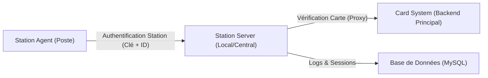

# YOOL Station Agent - Documentation Technique & Guide d'Utilisation

Bienvenue dans la documentation officielle du système **YOOL Station Agent**. Ce système sécurise l'accès aux postes de travail via une authentification par carte (QR/RFID) avec une architecture proxy centralisée.

---

## 1. Architecture du Système

Le système repose sur une architecture en trois couches pour garantir une sécurité maximale :



### Structure des données (BDD)
La YOOL Station utilise une base de données MySQL pour gérer l'état et la sécurité.

1.  **`stations`** : Enregistre chaque ordinateur (station) utilisant l'agent.
    - `station_code` (Unique) : Identifiant du PC (ex: `STA-001`).
    - `agent_key_hash` : Clé de l'agent hashée avec BCrypt.
    - `status` : `online`, `pending` (attente activation), `maintenance`.
    - `location` : Emplacement physique du poste.
    - `last_seen` : Horodatage du dernier battement de coeur (Heartbeat).
2.  **`sessions`** : Historique complet des utilisations par les étudiants.
    - `session_uuid` : ID unique de la session (standard UUID v4).
    - `student_id` : ID de l'étudiant vérifié par Module 1.
    - `card_uid` : Identifiant physique de la carte.
    - `status` : `active`, `completed`, `expired`.
3.  **`station_logs`** : Journal d'audit technique de la station.
    - `log_type` : `info`, `warning`, `error`, `security`.
    - `category` : `auth`, `system`, `sync`.
4.  **`used_jtis`** : Protection anti-rejeu pour les jetons SSO (JWT).
    - `jti` : Identifiant unique du jeton JWT.
    - `expires_at` : Date d'expiration.

> [!TIP]
> **Méthode Simplifiée** : Utilisez le script **`SETUP_DATABASE.bat`** à la racine du projet pour créer automatiquement la base de données et toutes ces tables sans taper de commandes SQL.

---

## 2. API Reference (Station Server)

Le Station Server agit comme un relais (Proxy) sécurisé entre l'Agent UI et le backend principal (Module 1).

**Base URL :** `http://localhost:3000/api`

### Endpoints Principaux :

| Méthode | Endpoint | Description |
| :--- | :--- | :--- |
| `POST` | `/stations/verify` | Relais validation carte vers Card System (Proxy). |
| `POST` | `/sessions/start` | Ouvre une session locale + Génère le Token JWT (SSO). |
| `POST` | `/sessions/end` | Ferme la session + Déconnexion Cloud (Webhook). |
| `POST` | `/stations/logs` | Enregistrement des logs système et d'audit. |
| `POST` | `/stations/heartbeat` | Signal de vie périodique des stations. |
| `GET` | `/health` | Diagnostic de santé du serveur (Base URL). |

---

### Concepts Clés de Sécurité :
1.  **Proxy Sécurisé** : L'Agent de station ne communique jamais directement avec le Card System. Il passe par le **Station Server**.
2.  **Secret Partagé** : La communication entre le Station Server et le Card System est authentifiée par une clé `CARD_SYSTEM_SECRET` inaccessible aux postes clients.
3.  **Hachage des Clés** : Les clés des stations (`AGENT_KEY`) sont stockées sous forme de hachage (BCrypt) en base de données. Même un accès à la BDD ne permet pas de connaître les clés en clair.
4.  **Auto-Enregistrement** : Toute nouvelle station se connectant avec un nouvel ID est enregistrée avec le statut **`pending`** et une localisation par défaut (ex: `Tinghir`). Elle doit être validée manuellement pour devenir opérationnelle.

---

## 3. Guide d'Installation (Manuel)
- Node.js (v16+)
- MySQL
- **Mode Développeur Windows** (Activé dans les paramètres système)
- Electron (inclus dans les dépendances)

3.  Configurez la sécurité et l'intégration :
    ```env
    JWT_SECRET=votre_secret_jwt_32_chars_minimum
    CARD_SYSTEM_API_URL=https://certifications.web4jobs.ma/api
    CARD_SYSTEM_SECRET=votre_secret_partage_card_system
    PLATFORM_LOGOUT_URL=https://certifications.web4jobs.ma/api/sso/logout
    ```

### Configuration de l'Agent (Station Agent)
1.  Copiez `.env.example` vers `.env` dans le dossier `YOOL_Station_App/yool-station-agent`.
2.  `VITE_STATION_ID` : L'identifiant unique de ce poste (ex: `STA-001`).
3.  `VITE_AGENT_KEY` : Une clé secrète complexe générée pour ce poste.
4.  `VITE_SERVER_URL` : L'URL de votre Station Server (ex: `http://localhost:3000`).

### 🚀 Lancement Automatique & Mode Kiosk (Windows 10)
Conformément au cahier des charges, l'agent doit se lancer au démarrage pour verrouiller le poste immédiatement :

1.  **Configuration du Démarrage (Auto-Run)** :
    *   **Méthode Automatisée (RECOMMANDÉE)** : Double-cliquez sur `INSTALL_AUTO_RUN.bat` à la racine du projet. Cela créera le raccourci nécessaire dans votre dossier de démarrage Windows.
    *   **Génération de l'Installateur** : Double-cliquez sur **`PREPARE_INSTALLER.bat`** à la racine pour générer votre exécutable Windows (`.exe`) prêt à l'emploi.
    *   **Méthode Manuelle** : Appuyez sur `Win + R`, tapez `shell:startup`, validez, et créez un raccourci vers `YOOL_Station_App/silent_launch.vbs`.
    *   Au redémarrage, le serveur et l'interface de scan se lanceront automatiquement en mode plein écran.

2.  **🔒 Sécurité Kiosk Totale** :
    *   L'application Electron est configurée pour le mode **Kiosk** (plein écran permanent).
    *   Pour une sécurité maximale (blocage de `Alt+Tab`, `Win`, `Alt+F4`), assurez-vous que les options de sécurité sont décommentées dans `YOOL_Station_App/yool-station-agent/main/index.js`.
    *   Le système est conçu pour qu'aucune carte valide = poste verrouillé.

3.  **Vérification** : Redémarrez le poste. L'écran de scan YOOL doit apparaître avant que l'utilisateur puisse accéder au bureau.

---

## 3. Guide d'Utilisation (Opérationnel)

### Étape 1 : Onboarding d'une Station
Lorsqu'une nouvelle station est lancée pour la première fois :
- Elle envoie sa clé et son ID au serveur.
- Le serveur l'enregistre automatiquement.
- L'utilisateur verra le message : **"En attente de validation admin"**.

### Étape 2 : Validation par l'Administrateur
Pour activer la station :
1.  Connectez-vous à votre base de données MySQL.
2.  Dans la table `stations`, trouvez la ligne correspondant au `station_code` du nouveau poste.
3.  Changez la colonne `status` de `'pending'` à **`'online'`**.
4.  La station est maintenant opérationnelle !

### Étape 3 : Utilisation Quotidienne
- **Scan de carte** : L'utilisateur scanne sa carte. L'agent demande au proxy de vérifier.
- **Déverrouillage** : Si autorisé par le Card System, le poste se déverrouille (l'application Electron se minimise).
- **Session** : Une session est créée en base de données avec l'heure de début.
- **Auto-Verrouillage (Inactivité)** : Si le poste est inactif trop longtemps (configuré par `VITE_INACTIVITY_TIMEOUT`), il se reverrouille automatiquement, ferme la session locale et déclenche la déconnexion sur la plateforme YOOL.
- **Déconnexion Manuelle** : L'utilisateur peut se déconnecter via le bouton dédié, ce qui provoque le verrouillage immédiat et le Single Logout (SSO).

### Étape 4 : Maintenance (Arrêt total)
Pour arrêter proprement tous les services (Serveur + Agent), **double-cliquez** sur `YOOL_Station_App/stop_all.bat`.

---

---

## 4. Maintenance et Troubleshooting

### Logs d'Audit
Consultez la table `station_logs` pour voir les événements système (erreurs d'auth, démarrages, etc.).

### Erreur "Clé Agent Invalide"
Cela signifie que la `VITE_AGENT_KEY` dans le fichier `.env` de l'agent ne correspond pas au hash stocké en base de données.
**Solution** : Supprimez la ligne de la station dans la BDD pour qu'elle se ré-enregistre proprement avec sa nouvelle clé.

### 🔒 Sécurité Kiosk (Configuration Avancée)
L'agent est configuré pour verrouiller le poste par défaut. Pour activer le verrouillage total des touches système (Alt+Tab, Win, Alt+F4), décommentez le bloc de sécurité dans `YOOL_Station_App/yool-station-agent/main/index.js` (ligne ~170).

---

## 🧪 5. Données de Test (Cartes)

Les cartes suivantes sont disponibles pour tester le système (si le script SQL d'initialisation a été utilisé) :

| Carte ID | Étudiant | Statut | Résultat Attendu |
| :--- | :--- | :--- | :--- |
| `QRMLHY43AHXV7ZVF` | Ahmed Bennani | ✅ Active | Accès autorisé (Redirection SSO) |
| `QRMLFJQPENAKVGW3` | Fatima Alaoui | ✅ Active | Accès autorisé |
| `QRMLFJQ1K0BOJ0XU` | M. El Fassi | ⛔ Suspendue | Accès refusé |

---

## 🔑 6. Spécifications SSO JWT (Module 6)

Le système utilise des jetons JWT (JSON Web Tokens) pour l'authentification Single Sign-On avec la plateforme YOOL.

### Architecture SSO
1. **Agent (SP)**: Génère un jeton signé lors du scan de carte.
2. **Platform (IdP)**: Valide le jeton et ouvre la session Web.

### Claims obligatoires
- `iss` : `yool-station-server`
- `aud` : `yool-platform`
- `jti` : UUID unique (Protection anti-rejeu)
- `sub` : ID de l'étudiant
- `sid` : ID de session station (pour Single Logout)

### 🛡️ Sécurité & Anti-Rejeu
- **JTI Verification**: La plateforme **doit** vérifier que le `jti` n'a pas déjà été utilisé via une table `used_jtis`.
- **Single Logout**: Lors d'un verrouillage local, l'agent envoie un signal `logout` à la plateforme pour fermer instantanément la session Web.
- **HTTPS**: obligatoire en production pour protéger les jetons en transit.

---

*Développé avec ❤️ pour YOOL Card System.*
